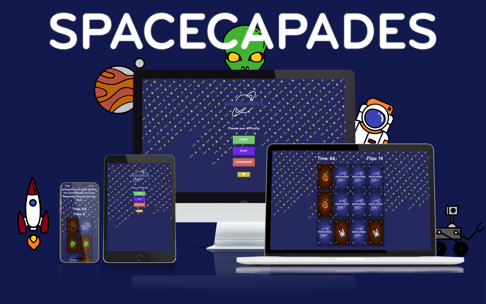
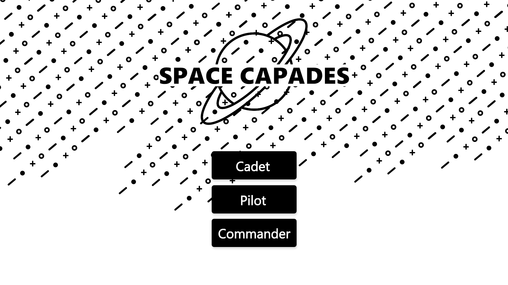
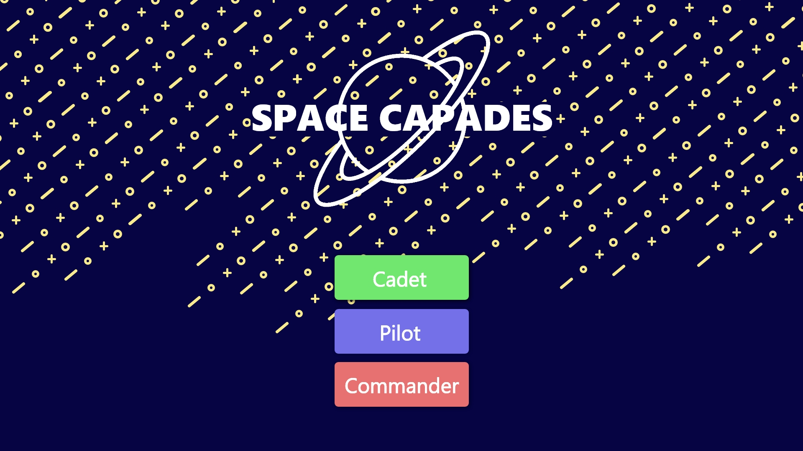

#  SpaceCapades 

SpaceCapades is a memory card game that teaches young children  5-10  about the wonders of the solar sytem, the game is set up into 3 difficulties, Cadet, Pilot & Commander. Whereby the player must use their memory to match sets of space related cards before the timer runs out. upon matching a set of cards information or facts about the matched set will display on screen, the information will change as the game progresses instilling a sense of learning and progression for the player. Upon Victory the player will be allowed to move on to the next level. 

# UX

## An Overview of : The Why?

For My second project I set out knowing I wanted to build something highly interactive. It took me sometime to decide whether I wanted to focus on something heavily API based or dive deeper into JavaScript and build something outside of my comfort zone. A project that I could ultimately learn from.  
I settled on the idea of a card game, as I had fond memories growing up and playing many with family. As we interacted and played I'd listen to my older relatives discuss news and ideas and I always left the table knowing a little more then when I sat down. Throughout this project I felt very strongly
about recreating that environment for the user, therefore every decision made was geared towards creating a re-playable experience that would stimulate the user both visually and intellectually. Hence the addition of multiple levels, Incentives in the form of Facts being displayed on every card match and 
garnering a strong sense of community with the creation of a competitive Hi-Score system using Google FireBase/Firestore (I still got to add an API in the end, Hooray!).

## User Goals
 
User goal:  This site's users are expected to be young children between the ages of 5-10 who will use the site recreationally to learn about our planet, the solar sytem and the universe beyond. It is meant purely for the engagement and learning of the user.

User expectation: 

* The User Can expect to have a clear understanding of the global Game state - Seperate Overlays have been Created At Start, Victory and Loss times. 
  The Victory and loss screens in particular having custom animations that give the user a sense of accomplishment or in the traditional game over sense the incentive/push to try again.
* The start Screen provides a clear indication of level difficulties with universally recognisable colour schemes green for Cadet, indigo/blue for  Pilot & red for the hardest difficulty Commander.  
  The difficulty levels were also named after airforce/NASA related Ranks that players may be familiar with, again to instill and clarify the level of the challenge ahead.
* Each level of difficulty will have more cards to match in the same time parameter, 8 for Cadet, 12 for  Pilot & 16 for Commander.
* The colour gold as well as a trophy image (credit to <a href="https://fontawesome.com/">FontAwesome</a>) was also used to indicate the Scores button on the start screen where users can expect to see a list of the top ten hi-scores ordered by time remaining.
* Measures where taken to ensure that the facts displayed as the user plays through the game are relevant and diverse, filtering was also used to ensure that each fact although random could not be displayed twice in a row.

Site Owner's goal: is to create a visually appealing & creative experience that will engage with and garner the attention of a younger audience all the while educating and increasing their knowledge of topics such astrology and physics. The site owner wishes to attract parents to the platform to be used as a preferred tool for learning.

Site Owner's Expectations:

Below are the main questions I asked myself throughout the development process:

* Is this obvious to the user? - specifically when dealing with the overal interactivity of the game and presentation of information,
I.E. how easy is it to get from A to B? are the visual and navigational choices delightful? Is there weight to the animation? Does it relate/re-create a real life model or experience?
More simply - do the cards flipping look like real cards?.
* Is it pretty? - Does the overall UI look inviting? is there an obvious theme or color scheme? Is it attractive to my users, do they engage with the pictures and images used? 
Are the colours vibrant enough for a younger child? Does it stimulate their imagination and would they come back for more?
* Is it interactive? - Does the site offer both visual and audio queues to the user? Are the responses timely? Do they add to the understanding of the user? Do they add to the interactivity of the user and add weight to the users choices?
* Is it fun? - Am I building something enjoyable to play? Is it challenging within reason? Does it offer incentive to return? Is there more value to playing multiple times? Can the user get better at it? Does the user have the ability to increase the level of challenge?

## User Stories

The Parent - I love my child and I care about their development. I'm excited for them to use technology but I want them to develop healthy habits and have good relationships with their devices. I want to encourage them to use websites and applications that compliment their learning at school, as well as engage them and allow them to have fun at the same time.

The Child - I am curious and inquisitive. I'm young and I want to try new things. I'm already developing a strong sense of what I like and dislike. I like playing games on my iPad and my favourites are ones about space or dinosaurs. School is fun but paying attention isn't. My favourite lessons are when we learn about space and the stars and planets. I think I like science and want to be a scientist when I grow up. 

## Poject Scope:

The Project was built to a schedule in order to be submitted by my soft deadline, of 18th of August 2020. It was therefore of the utmost importance that certain features were scoped out in order to do prioritise importance and functionality over embellishment and possible feature creep. I am happy to report however that at the time of writing this I feel as though I've accomplished a project which is well rounded and runs smoothly as expected.

Drawing from my experience studying product management, The features were divided using agile principals in the typical Now,Then, Later fashion as one would see when using the likes of Jira and other agile based frameworks.

## Now
* Research to be made viewing similar projects (as this was my first time writing anything in JS outside of the codeinstitute examples)

* A core game to be designed.
    * Visual Game layout
    * JavaScript style (Object,Oriented)
    * implementing Shuffling function. 
    * start game state
    * failsafes to ensure cards cant be manipulated so as to break the rules or immersion of the user.

* A core UI to be made.
    * Cards
    * Basic functional animations
    * start, win, loose overlays to be implemented.

* A Start screen precluding and announcing the game.
    * Game title
    * functional buttons to act as links to the game page.

## Then
* function getRandomFact() - which pushes facts when called.

* added levels of functionality.
    * cadet level added
    * pilot level added

* Final styles and animations.

## Later
* Hi-Score system to be implemented
    * learning google firebase
    * creating a method to send scores and add them as a visual table of information for the user.

* To be implemented
    * further manipulation and table creation to show scores in relation to their level of difficulty.
    * Perhaps further levels of difficulty with different time goals 
    * Deeper testing using Jasmine
    * Possible Redesign to turn the project into and SPA or single page application.

## Design Structure

The game as well as index page was always to be designed with the idea of a clean cut simple user interface that focuses on the task at hand. This was done inorder not to break user immersion by adding in unnecessary distraction to gameplay. In short I wanted a layout that would incorporate the best from both its design and function. All the game elements are centered. Although bootstrap is used to design the first page. The second page uses mainly CSS grid to style the cards, this change was made due to the ability for css grid to assign random indexes to elements making shuffling the order of my card elements easier. 

## Skeleton

I used Adobe XD to create the wire-frames for the game's start page and I based the stucture of the game from a video by youtube user <a href="https://www.youtube.com/channel/UCFbNIlppjAuEX4znoulh0Cw">WebDevSimplified</a> who can be found credited below in detail as my main inspiration for the stylings of this project.

Please find an example of some of my artboards below.

## Colour scheme
The Colour scheme was kept simple and representative of a nightsky/space environment

* Deep blues mainly : #4b53c6 and #090a19 used for the background and back/face of the cards, the latter used to create a radial gradient on the back face of the card. 

* Pure white was used for all the typography as it stood out and was easily readable in contrast to the darker background.

* Universally recognisable colour schemes were used for the difficulty buttons,  green for Cadet, indigo/blue for  Pilot & red for the hardest difficulty Commander.

* By contrast the color schemes for the pictures on the front faces of the cards were very diverse and attempted to stay very true to the real life counterparts of the images.

## Typography

As Always the font choice needed to be specific. I wanted the font to feel both gameified and futuristic, I was really excited when I stumbled upon the BryantPro2 font family. It instantly felt very unique and fit in very well overall in this project, the font is available for download in the assets folder of this project. It is also deployed locally as google fonts don't seem to have it freely available.

# Features

## Existing features

### Site Wide.

* The entire site makes use of the Google Firebase API, which enables me to maintain a server containing hi-scores ready for display. Google's API has great documentation and is implemented by use of the API key found in index.JS.

### Index.HTML
* Here you can find the home screen interface complete with game-title (animated), varying levels of difficulty and trophy/hi-scores button, which triggers an overlay and displays the score inputed by the user at the end of each successful level.
    * The animations for the buttons were done with a mixture of custom jquery and hover CSS
    * The hi-scores are held server-side using Google's firebase API.
    * Query parameters were used in the Href of each level to help tell the game what difficulty to run. 
    * bootstrap was used inorder to ensure mobile compatibility as well as a quick easy single column design.
    * Difficulty buttons are also labelled.

### Game.HTML
   * Here you can see the main game page, featuring timer-countdown, flip counter and game cards in grid. All cards are animated purely in css using both a mixture of :hover psudo-classes and a few simple event listeners in the script.js folder which add the .visible class. This page also features the games status overlays, such as start game, game over and ofcourse the seperately featured victory-overlay. Upon match a spaceFact will appear dynamically centered at the top of the page.
       * perspective was used in order to make the card flipping animation. 
       * custom animations were created for the back of the cards to indicate which card is being selected by the user.
       * The script.js features an function with an array of facts sourced from various space websites that can be found credited below.
      * The shuffling Algorithm - I used the fisher/Yates shuffling algorithm which.
     1) this algorithm takes an array and works through it backwards from [-1] to [0]
     2) for each iteration, it creates a random INT which is >= 0 and <= to i
     3) it then exchanges the random number created with the position of the one being iterated, And thats the shuffle!

please find this credited below or visit
<a href="https://en.wikipedia.org/wiki/Fisher%E2%80%93Yates_shuffle">This Wikipedia link</a> to see a fully provided explanation as well as pseudo-code. 

* The Victory Overlay is particularly special as it contains the form and calculated end score that it will send to the firebase server. The results to then be displayed on index html 

* The startGameLevel() function that I made is one that I am particularly proud of as it uses custom CSS level classes and the games Object oriented code to determine which cards to allow and which to leave out depenting on the difficulty shown by the query parameters.

* The game Features an Object oriented approach which centers around the custom GameLevel class, which acts as a blueprint for the outline of the game and has allowed me to use the properties of encapsulation, Abstraction, inheritance and polymorphism to group sets of functions and execute the games core code very cleanly.

* Sounds - the game also features sounds and backings that can all be executed through a custom class called AudioControls.

### To be implemented
* further manipulation and table creation to show scores in relation to their level of difficulty.
* Perhaps further levels of difficulty with different time goals 
* Deeper testing using Jasmine
* Possible Redesign to turn the project into and SPA or single page application.

# Technologies Used

## HTML5
* Comprising of 52.6% of my entire code was Used to implementd the structure and elements essential to my site.
## CSS3
* Was used to style my entire project.
* CSS grid was used to create the table structure of my cards and allowed for the randomIndex property to be added to the shuffling function. Originally if you look far back enough you can see I built the game in pure bootstrap and then had to make the switch due to the limitations in bootstrap.
## JavaScript ES6
* Was used to create the functionality of the game, dynamic level functions as well as connect to the firebase API.
## Jquery
* Used purely to test out some animations on the first page and made the code a little cleaner.
## Bootstrap
* Used to style the navigational index.html page of the website.
## Hover CSS
* Used for the Button animations.
## Git
* Used for implementation and version control.
## GitHub
* Used for the storing of the repositiory.
## GitPod
* The IDE used for the development of the entire project.
## Adobe XD
* Used for the mockups and wireframes.
## Freepik
* Used to source the .PNG card pictures used in the design of this project.

# Deployment

## Deployment To Github Pages

In my account GitHub website, I selected Repositories

I selected SpaceCapades from the GitHub Dashboard.

I navigated to Settings and to the GitHub Pages section.

From the Source section, I clicked on the drop-down menu and selected Master Branch.

Once Master Branch is selected, the page has been automatically refreshed, with a detailed ribbon display GitHub Source Saved Pages indicating the successful implementation.

The live link can be found here -<<DEPLOYED URL IN GH PAGE>>

## PLEASE NOTE

Allow a few minutes to pass before opening your newly deployed link! Clicking this link too quickly may result in a failure to build the site, causing an Error 404 page instead.

Local Deployment

To run locally, you can do one of the following two options

Clone the repository using the git clone <<name of your .git file>> command

Download the zip file, unzip and run it in your favourite local IDE (such as VS Code)

# Credit

